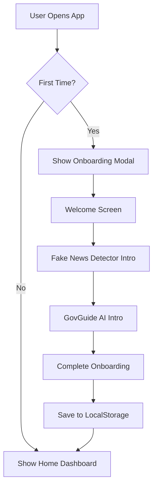
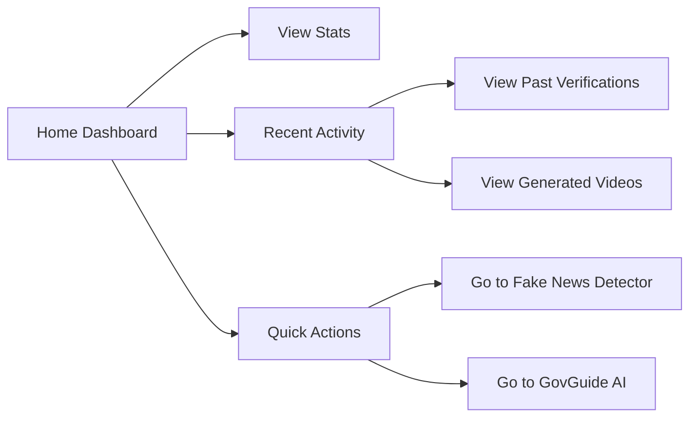
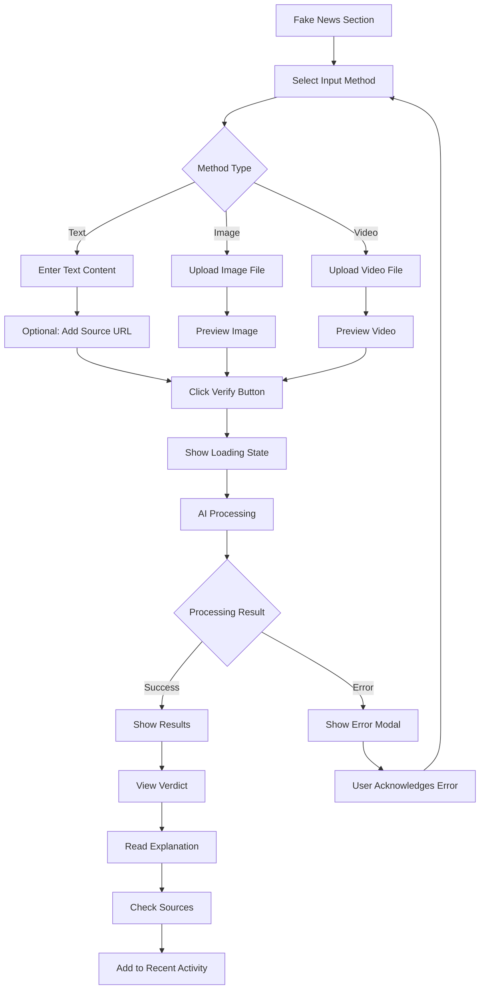
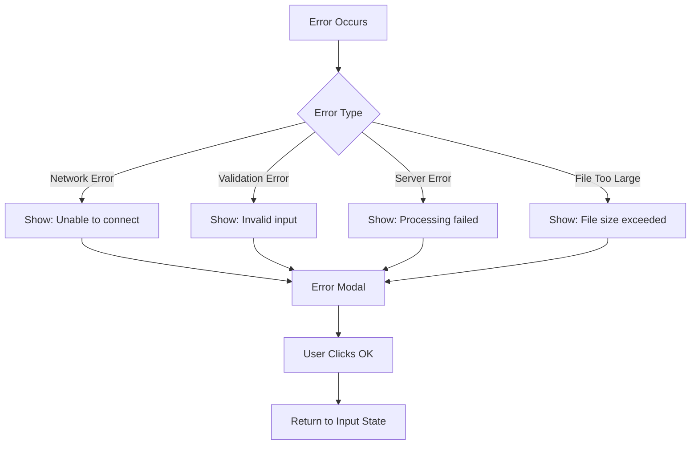
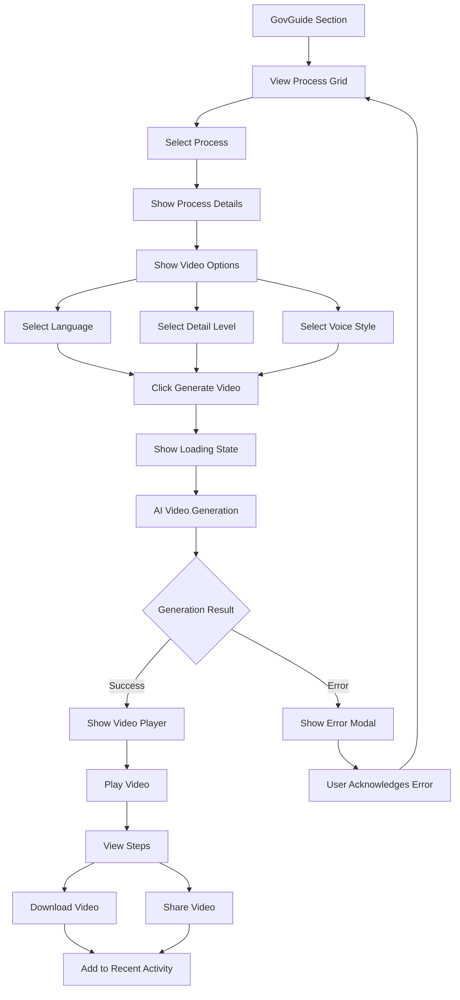
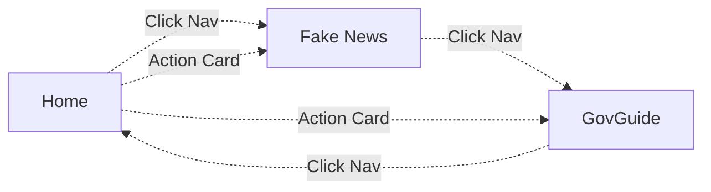

# ==========================================
# LAYER 6: COMPLETE USER FLOW
# Step-by-step user interaction flows with all states
# ==========================================

## ONBOARDING FLOW

### First-Time User Journey



**Detailed Steps:**

1. **App Launch**
   - Load application
   - Check `localStorage` for onboarding status
   - If `onboardingComplete !== 'true'`, show modal

2. **Step 1: Welcome**
   - **Screen:** Welcome message with TruthChain PH logo
   - **Content:** "Maligayang pagdating sa TruthChain PH!"
   - **Action:** User clicks "Simulan" button
   - **State Change:** Move to Step 2

3. **Step 2: Fake News Detector**
   - **Screen:** Feature overview with icon
   - **Content:** Explanation of verification features
   - **Actions:** "Bumalik" (previous) or "Susunod" (next)
   - **State Change:** Navigate between steps

4. **Step 3: GovGuide AI**
   - **Screen:** Video generation feature overview
   - **Content:** Explanation of video guides
   - **Actions:** "Bumalik" or "Simulan na!"
   - **State Change:** Complete onboarding

5. **Completion**
   - Save `onboardingComplete: true` to localStorage
   - Close modal with fade-out animation
   - Show home dashboard

---

## HOME DASHBOARD FLOW

### Dashboard Overview



**User Interactions:**

1. **View Statistics**
   - **Display:** 3 stat cards
     - Verified Count: 1,247 (auto-updating)
     - Video Count: 523 (auto-updating)
     - User Count: 12,458 (auto-updating)
   - **Update Frequency:** Every 30 seconds via API
   - **Animation:** Hover effect on cards

2. **Action Cards**
   - **Fake News Detector Card**
     - Icon: Search/magnifying glass
     - Title: "I-verify ang Balita"
     - Description: Upload text/image/video
     - **Action:** Click → Navigate to Fake News section
     - **Animation:** Card lifts on hover
   
   - **GovGuide AI Card**
     - Icon: Video camera
     - Title: "GovGuide AI"
     - Description: Generate explainer videos
     - **Action:** Click → Navigate to GovGuide section
     - **Animation:** Card lifts on hover

3. **Recent Activity**
   - **Display:** Last 10 activities in reverse chronological order
   - **Types:**
     - Verified content (green check icon)
     - Fake news detected (red X icon)
     - Generated videos (blue video icon)
   - **Format:** Title + timestamp ("2 minutes ago")
   - **Interaction:** Hover highlights row
   - **Auto-refresh:** Updates when new action completes

---

## FAKE NEWS VERIFICATION FLOW

### Complete Verification Journey



### Detailed Step-by-Step Flow

#### PHASE 1: Input Selection

**Step 1: Choose Input Method**
- **Screen:** Three method buttons (Text, Larawan, Video)
- **Default:** Text method selected
- **Interaction:**
  - Click button → Highlight with blue background
  - Other buttons → Return to default state
  - Show corresponding input container
- **State:** `currentInputMethod = 'text'|'image'|'video'`

#### PHASE 2: Content Input

**Option A: Text Input**
1. **Display:** Large textarea (6 rows)
2. **Placeholder:** "Paste mo dito ang balita..."
3. **Optional:** Source URL input field
4. **Validation:**
   - Text must not be empty
   - URL format validation (optional field)
5. **Button:** "I-verify ang Balita" (enabled when text entered)

**Option B: Image Upload**
1. **Display:** Upload zone with dashed border
2. **Interaction Methods:**
   - Click zone → Open file picker
   - Drag & drop → Drop file
3. **File Validation:**
   - Format: PNG, JPG, JPEG only
   - Size: Max 10MB
   - Show error if invalid
4. **Preview:**
   - Show uploaded image
   - Display filename and size
5. **Button:** "I-verify ang Larawan" (shown after upload)

**Option C: Video Upload**
1. **Display:** Upload zone with video icon
2. **Interaction Methods:**
   - Click zone → Open file picker
   - Drag & drop → Drop file
3. **File Validation:**
   - Format: MP4, AVI, MOV only
   - Size: Max 50MB
   - Show error if invalid
4. **Preview:**
   - Show video player with controls
   - Display filename and size
5. **Button:** "I-verify ang Video" (shown after upload)

#### PHASE 3: Verification Processing

**Step 1: User Clicks Verify Button**
- **Action:** Call `verifyNews(type)` function
- **State Change:** Hide input, show loading

**Step 2: Loading State**
- **Display:**
  - Spinning loader icon (blue gradient)
  - Text: "Ini-verify ang content..."
  - Subtext: "Sandali lang, sinusuri ng AI..."
- **Duration:** 2-5 seconds (actual API call time)
- **Animation:** Continuous spinner rotation

**Step 3: API Call**
```javascript
POST /api/verify
FormData: {
  type: 'text|image|video',
  content: '...' (if text),
  file: File (if image/video),
  sourceUrl: '...' (optional)
}
```

**Step 4: AI Processing**
- Server validates input
- Calls AI verification (Qwen-2.5)
- Generates verification result
- Returns JSON response

#### PHASE 4: Results Display

**Success State: Verification Complete**

**Result Header:**
- **VERIFIED Status (Green):**
  - Background: Light green gradient
  - Icon: Green check circle (large)
  - Title: "Verified - Totoo"
  - Confidence Bar: Green progress bar
  - Score: "87%" (example)

- **FAKE Status (Red):**
  - Background: Light red gradient
  - Icon: Red X circle (large)
  - Title: "Fake News - Hindi Totoo"
  - Confidence Bar: Red progress bar
  - Score: "92%" (example)

- **UNVERIFIED Status (Orange):**
  - Background: Light orange gradient
  - Icon: Warning triangle (large)
  - Title: "Di Makumpirma"
  - Confidence Bar: Orange progress bar
  - Score: "65%" (example)

**Result Body Sections:**

1. **Paliwanag (Explanation)**
   - Icon: Info circle
   - Content: Filipino/Taglish explanation
   - Format: Paragraph text
   - Example: "Ang balitang ito ay totoo at napatunayan..."

2. **Bakit Fake? (For FAKE status only)**
   - Icon: Warning triangle
   - Content: Detailed breakdown of why it's fake
   - Format: Numbered list or paragraph
   - Example: "Fake dahil: (1) Walang official statement..."

3. **Sources**
   - Icon: Link icon
   - Content: List of credible sources
   - Format: Clickable links in gray box
   - Each source:
     - Title (clickable)
     - URL (opens in new tab)
     - Icon: External link

4. **Timestamp**
   - Icon: Clock
   - Content: Verification timestamp
   - Format: "November 19, 2025, 10:30 AM"

**User Actions on Results:**
- Read full explanation
- Click source links (open in new tab)
- Scroll through content
- No explicit "close" - can navigate away

#### PHASE 5: Post-Verification

**Step 1: Add to Recent Activity**
- Create activity item
- Insert at top of recent activity list
- Keep only last 10 items
- Update UI immediately

**Step 2: Update Stats**
- Increment verified count
- Refresh dashboard stats
- Animate count change

**Error Handling Flow:**



**Error Modal Display:**
- Red exclamation icon
- Error title (specific to error type)
- Error message (user-friendly Filipino)
- "OK" button to dismiss
- Click outside modal to close

---

## GOVGUIDE VIDEO GENERATION FLOW

### Complete Video Generation Journey



### Detailed Step-by-Step Flow

#### PHASE 1: Process Selection

**Step 1: View Process Grid**
- **Display:** 8 process cards in grid layout
  - Passport Application (passport icon)
  - Driver's License (ID card icon)
  - NBI Clearance (document icon)
  - BIR Registration (invoice icon)
  - SSS Registration (badge icon)
  - PhilHealth (heartbeat icon)
  - Pag-IBIG (home icon)
  - Business Permit (briefcase icon)

**Step 2: Process Card Interaction**
- **Hover State:**
  - Background changes to blue
  - Text changes to white
  - Card lifts with shadow
- **Click:**
  - Add "selected" class
  - Border: yellow outline
  - Background: blue gradient
  - Trigger `selectProcess(processId)`

**Step 3: Show Process Details**
- **Animation:** Fade in from top
- **Content:**
  - Process icon and title
  - Description in Filipino
  - Duration estimate (e.g., "5-7 minutes")
  - Difficulty level (Easy/Medium/Hard)
- **Layout:** Gray background box

#### PHASE 2: Video Options Configuration

**Display:** Options form appears below process details

**Option 1: Language Selection**
- **Label:** "Wika / Language:"
- **Options:**
  - Tagalog (default)
  - Taglish
  - English
- **Control:** Dropdown select
- **Interaction:** Change updates `language` parameter

**Option 2: Detail Level**
- **Label:** "Detail Level:"
- **Options:**
  - Basic - Quick overview
  - Detailed - Step-by-step (default)
  - Comprehensive - Full guide
- **Control:** Dropdown select
- **Interaction:** Change updates `detailLevel` parameter

**Option 3: Voice Style**
- **Label:** "Voice Style:"
- **Options:**
  - Friendly & Casual (default)
  - Professional
  - Enthusiastic
- **Control:** Dropdown select
- **Interaction:** Change updates `voiceStyle` parameter

**Generate Button:**
- **Label:** "Generate Video"
- **Icon:** Magic wand
- **Style:** Large primary button
- **State:** Enabled when process selected
- **Action:** Call `generateVideo()`

#### PHASE 3: Video Generation Processing

**Step 1: User Clicks Generate**
- **Action:** Call `generateVideo()` function
- **Validation:** Ensure process selected
- **State Change:** Show loading, hide options

**Step 2: Loading State**
- **Display:**
  - Spinning loader (blue gradient)
  - Text: "Ginagawa ang video..."
  - Subtext: "Sandali lang, ginagawa ng AI..."
  - Progress bar (animated 0-90%)
- **Animation:**
  - Spinner rotates continuously
  - Progress bar fills gradually
  - Shimmer effect on bar
- **Duration:** 3-8 seconds

**Step 3: API Call**
```javascript
POST /api/generate-video
JSON: {
  processId: 'passport',
  language: 'tagalog',
  detailLevel: 'detailed',
  voiceStyle: 'friendly'
}
```

**Step 4: AI Processing**
- Research process requirements
- Generate video script
- Create video with narration
- Upload to Alibaba OSS
- Return video URL and metadata

#### PHASE 4: Video Player Display

**Success State: Video Ready**

**Video Player Section:**

1. **Video Header:**
   - Title: "Generated Video: [Process Name]"
   - Subtitle: Process description

2. **Video Player:**
   - **Container:** 16:9 aspect ratio wrapper
   - **Player:** HTML5 video element
   - **Controls:** Play/pause, seek, volume, fullscreen
   - **Autoplay:** Starts automatically
   - **Quality:** 1080p MP4
   - **Source:** Alibaba OSS URL

3. **Video Info Box:**
   - **Background:** Light gray
   - **Title:** "Video Steps:"
   - **Content:** Numbered step list
   - **Format:**
     - Step 1: "Mag-register online sa DFA"
     - Step 2: "Piliin ang processing type"
     - etc.

4. **Action Buttons:**
   - **Download Button:**
     - Icon: Download icon
     - Label: "Download Video"
     - Action: Trigger file download
     - Feedback: Success toast
   
   - **Share Button:**
     - Icon: Share icon
     - Label: "Share"
     - Action: 
       - If supported: Native share API
       - Fallback: Copy link to clipboard
     - Feedback: "Link Copied" toast

#### PHASE 5: Post-Generation

**Step 1: Add to Recent Activity**
- Create activity item
- Type: "Generated: [Process] Guide"
- Icon: Video icon (blue)
- Timestamp: "Just now"
- Insert at top of activity list

**Step 2: Update Stats**
- Increment video count
- Refresh dashboard
- Animate number change

**Step 3: Show Success Modal**
- Green check icon
- Title: "Video Generated!"
- Message: "Ang iyong GovGuide video ay handa na!"
- Button: "OK"
- Auto-dismiss after 3 seconds (optional)

**User Post-Actions:**
- Watch video
- Download for offline viewing
- Share with others
- Generate another video (select new process)
- Navigate to other sections

---

## NAVIGATION FLOW

### Section Navigation



**Desktop Navigation:**
- **Top Navigation Bar:**
  - Logo + "TruthChain PH" (left)
  - Nav links (center):
    - Home
    - Fake News Detector
    - GovGuide AI
  - Active link highlighted (blue background)
  - Hover effect on links

**Mobile Navigation:**
- **Hamburger Menu:**
  - Icon: Three horizontal bars (top right)
  - Click → Full-screen overlay menu
  - Links displayed vertically
  - Large touch targets
  - Click link → Navigate + close menu

**Section Transitions:**
- **Animation:** Fade in (300ms)
- **Behavior:**
  - Hide all sections
  - Show selected section
  - Update active nav link
  - Scroll to top
  - Update URL hash (optional)

---

## MOBILE RESPONSIVE FLOW

### Mobile Adaptations

**Screen Size Breakpoints:**
- Desktop: > 768px
- Tablet: 481-768px
- Mobile: ≤ 480px

**Mobile-Specific Changes:**

1. **Home Dashboard:**
   - Stats: Single column layout
   - Action cards: Stack vertically
   - Recent activity: Full width

2. **Fake News Section:**
   - Input methods: Vertical stack
   - File upload zones: Larger touch targets
   - Results: Full width, scrollable

3. **GovGuide Section:**
   - Process grid: 2 columns (small screens)
   - Process grid: 1 column (very small)
   - Video player: Responsive 16:9
   - Options: Full width dropdowns

4. **Navigation:**
   - Hide desktop nav links
   - Show hamburger menu
   - Full-screen mobile menu overlay

---

## ERROR STATES & HANDLING

### Error Scenarios

**1. Network Errors**
- **Trigger:** API unreachable
- **Display:** "Unable to connect to server"
- **Message:** "Please check your internet connection"
- **Recovery:** Retry button

**2. Validation Errors**
- **Trigger:** Invalid input
- **Display:** "Invalid Input"
- **Message:** Specific error (e.g., "File too large")
- **Recovery:** Fix input, resubmit

**3. Server Errors**
- **Trigger:** 500 server error
- **Display:** "Processing Failed"
- **Message:** "Something went wrong. Please try again."
- **Recovery:** Retry from beginning

**4. File Upload Errors**
- **Trigger:** Wrong format or size
- **Display:** "Invalid File"
- **Message:** Specific limitation
- **Recovery:** Upload valid file

---

## LOADING STATES

### Loading Indicators

**1. Initial App Load**
- Browser default loading
- Show page when DOM ready

**2. Stats Update**
- Silent background refresh
- No loading indicator
- Smooth number transition

**3. Verification Processing**
- Prominent spinner
- Explanatory text
- Full container replacement

**4. Video Generation**
- Spinner + progress bar
- Multi-line text feedback
- Progress simulation (0-90%)

**5. File Upload**
- Instant preview (from FileReader)
- No loading state needed

---

## SUCCESS STATES

### Success Confirmations

**1. Verification Complete**
- **Display:** Results container
- **Feedback:** Visual verdict (colors, icons)
- **No Modal:** Results inline

**2. Video Generated**
- **Display:** Video player
- **Feedback:** Success modal (optional)
- **Message:** "Video ready!"

**3. Download Started**
- **Display:** Toast notification
- **Message:** "Download started"
- **Duration:** 3 seconds, auto-dismiss

**4. Link Copied**
- **Display:** Toast notification
- **Message:** "Link copied to clipboard!"
- **Duration:** 3 seconds, auto-dismiss

---

## ACCESSIBILITY CONSIDERATIONS

**1. Keyboard Navigation**
- All interactive elements tabbable
- Visible focus indicators
- Logical tab order

**2. Screen Reader Support**
- Semantic HTML
- ARIA labels on icons
- Alt text on images
- Status announcements

**3. Color Contrast**
- WCAG AA compliance
- Readable text on all backgrounds
- Icon + text labels (not color alone)

**4. Touch Targets**
- Minimum 44x44px on mobile
- Adequate spacing between buttons
- Large clickable areas

---

This completes the comprehensive user flow documentation with all states, interactions, and edge cases covered!
